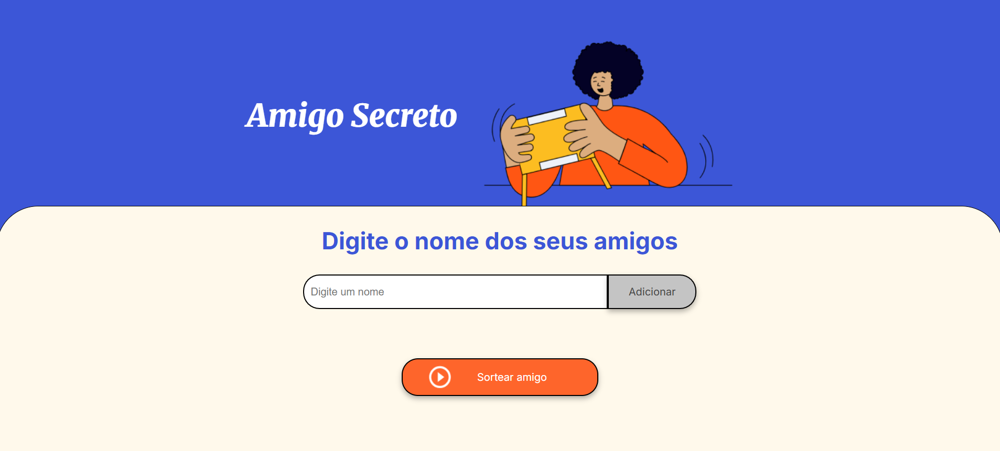

# Amigo Secreto

Este é um projeto simples de Amigo Secreto desenvolvido em HTML, CSS e JavaScript. O objetivo é permitir que os usuários adicionem nomes de amigos e sorteiem um amigo secreto de forma aleatória.

## Funcionalidades

- Adicionar nomes de amigos a uma lista.
- Exibir a lista de amigos adicionados.
- Sortear um amigo secreto aleatoriamente.
- Limpar a lista de amigos após o sorteio.

## Tecnologias Utilizadas

- HTML
- CSS
- JavaScript

## Instalação

Para rodar este projeto localmente, siga os passos abaixo:

1. Clone o repositório:
    ```bash
    git clone https://github.com/Artemisa1992/Amigo-Secreto.git
    ```
2. Navegue até o diretório do projeto:
    ```bash
    cd Amigo-Secreto
    ```

## Uso

1. Abra o arquivo `index.html` no seu navegador de preferência [aqui](https://artemisa1992.github.io/Amigo-Secreto/).
2. Adicione os nomes dos participantes e clique no botão de sortear para realizar o Amigo Secreto.
 

## Visualizar e Testar

Você pode visualizar e testar o projeto online [aqui](https://artemisa1992.github.io/Amigo-Secreto/).
